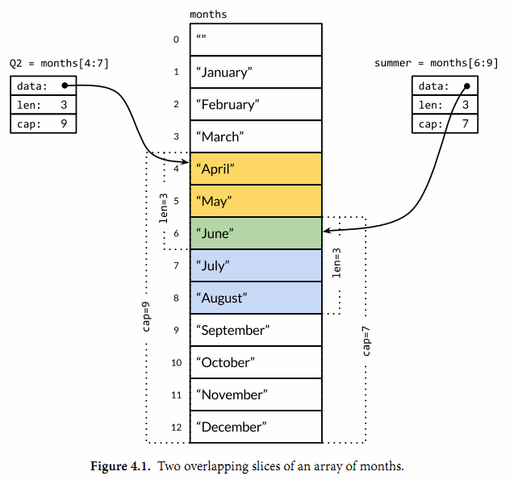

### 切片
#### 从对内存抽象角度理解切片
1. 指针是最底层的内存抽象，直接对应内存地址
2. 数组是对定长连续内存的抽象
3. 切片是对动态内存的高级抽象，提供了自动扩容功能

#### 切片本质

当切片没有超过cap时，切片就是对底层数据的引用，此时修改切片是会改变底层数据的
```Go
s := [...]int{1, 2, 3}
sl := s[0:1]
sl[0] = 100
sl  // 100
s   // 100, 2, 3
```
对切片进行扩展时，如果超过cap，会导致错误
```Go
// 对数组进行扩展
s := [...]int{1, 2, 3}
sl := s[0:4]    // 编译错误，不能对定长数据进行扩展

// 对切片数据进行扩展
s := []int{1, 2, 3}
sl := s[0:4]    // 运行时错误，虽然切片是动态类型，但是运行到这里时没有进行扩容，就会len>cap 就会导致运行时panic
```
使用append进行扩容，可能会改变引用的底层数据
```Go
s := []int{1, 2, 3}
append(s, 1)    // 在新版本编译器中，这种写法不允许，不能忽略append的返回值
s = append(s, 1)    // 将append的结果赋值给s，切片s引用的底层数据其实发生改变了，s重新绑定新的数据，那么旧的数据将会被gc清理
```
一个不发生底层数据改变的例子
```Go
s := make([]int, 5) // 创建一个cap=5, len=5的切片
sl := s[:4]
sl = append(sl, 1)
fmt.Printf("s = %v\n", s)   // [0 0 0 0 1]
fmt.Printf("sl = %v\n", sl) // [0 0 0 0 1]
```


